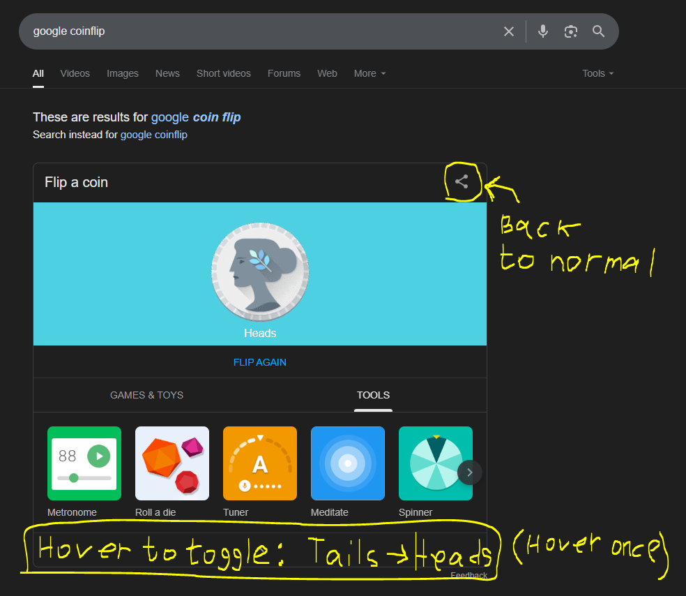

# google-coinflip-rigger

This userscript lets you rig the Google coin flip to always land as you choose, just to mess with your friends.

## Demo

## Features
- Toggle between always HEADS or TAILS (By Default it's HEADS only at first, though not on the automatic initial page load flip)
- Revert to normal random behavior.

## Installation
1. Install [Tampermonkey](https://www.tampermonkey.net/) (Or add Tampermonkey extension on your browser)
2. [Click here to get the script](https://raw.githubusercontent.com/tryez/google-coinflip-rigger/main/coinflip-rigger.user.js).
3. Add the script inside your Tampermonkey userscripts (Make sure that developer mode for extensions and "Allow User Scripts" are enabled for Tampermonkey)
4. Go to [Google Coin Flip](https://www.google.com/search?q=flip+a+coin).
5. Hover over the expansion bar below the suggested apps once to toggle between HEADS or TAILS.
6. You can go back to normal mode by hovering over the share icon on the top right of the coin container.

## License
MIT